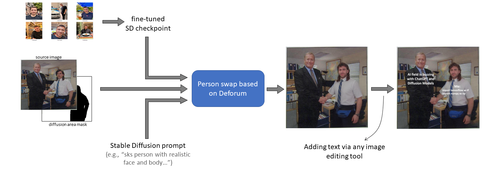
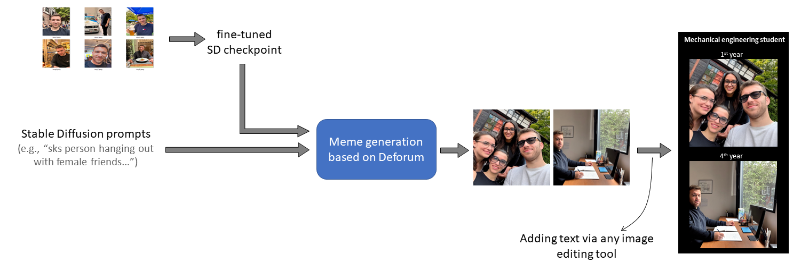

# Personalized meme generation using Stable Diffusion and Deforum
This repo contains scripts for generating personalized memes using [Stable Diffusion and Deforum](https://github.com/deforum-art/deforum-stable-diffusion). You can create memes from stratch by just prompting with your fined tuned model, or you can use popular memes as template. 

Pipeline with a template:


Pipeline without a template:


## Clone the code
When cloning the code, please use the following command to also clone the submodules:
```
git clone --recursive https://https://github.com/berkanz/meme-personalization-via-Deforum
```

## Usage
First of all, you need a finetuned SD model of yourself and move it into <mark>models</mark>. Secondly, you need to pick a template or create a new one. Then, simply run run.py scripts with two arguments as shown below: 

<ins>Script options:</ins>
```
python run.py --help
```

```            
  --meme_template            name of the meme template (e.g. michael_scott)      [str]
  --fine_tuned_model_path    path to the fine-tuned model                        [str]     
```

Generated meme will be saved at <mark>output</mark> subfolder.

Detailed description and instructions are given in the Medium blog: 